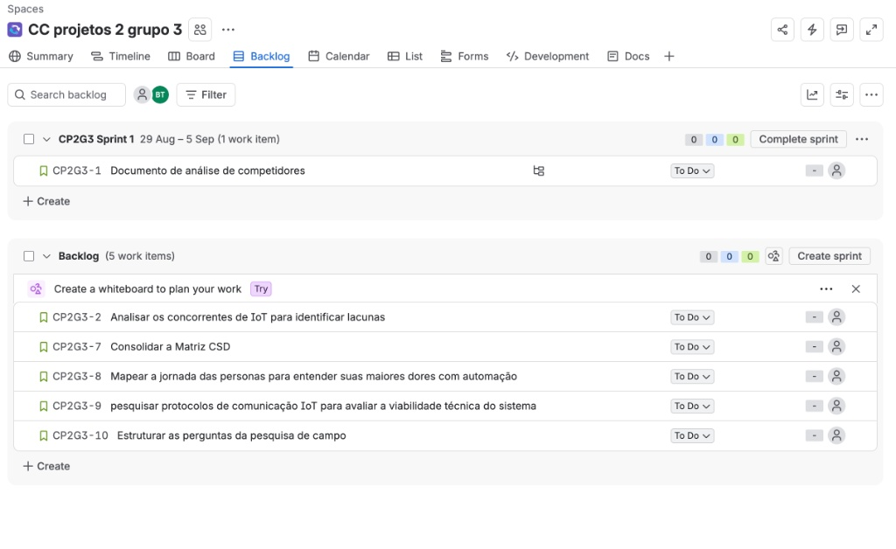
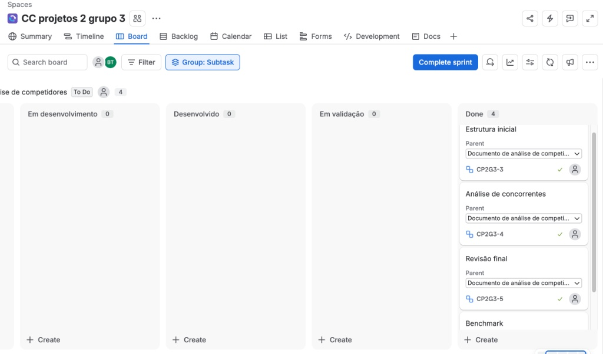
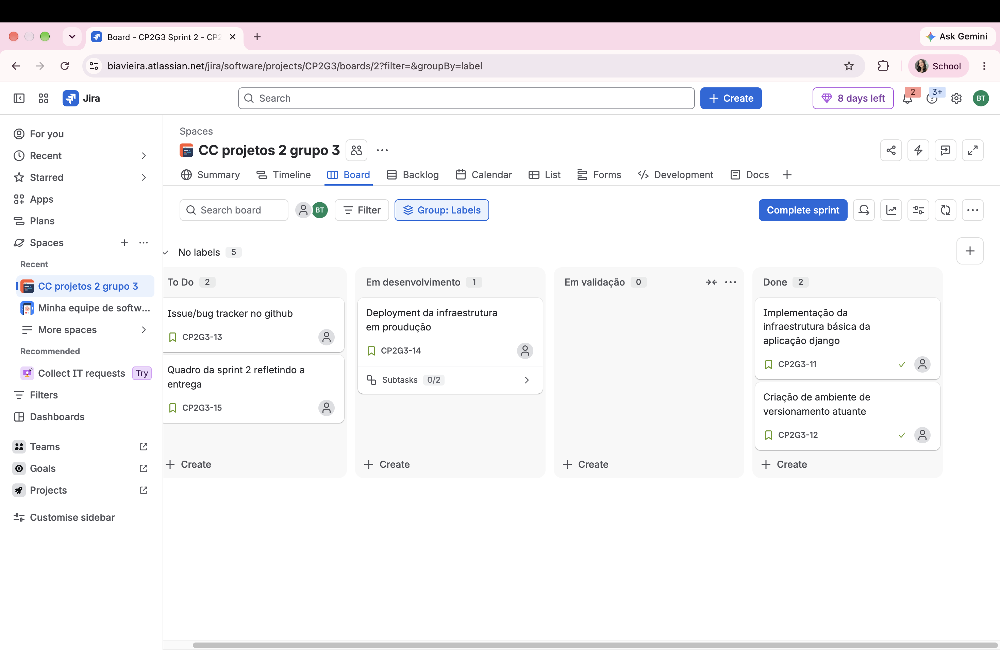
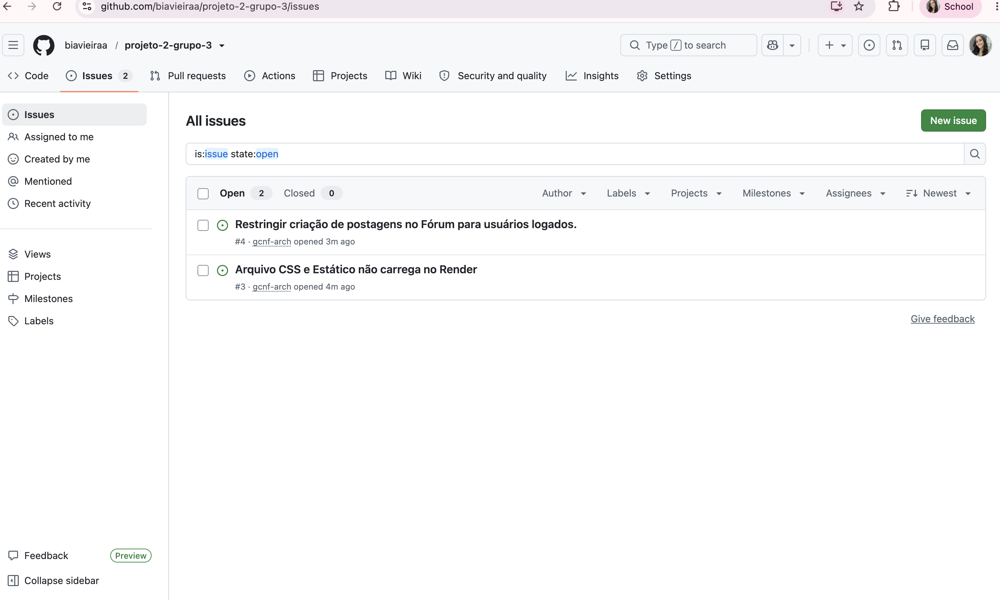

# BZU TECH — Grupo 3

Este repositório contém a documentação e o acompanhamento das etapas de desenvolvimento do nosso projeto, voltado para soluções de IoT. 

Para a organização das entregas e fluxo de trabalho da equipe, utilizamos a metodologia Scrum no Jira.

---

## Quadro Scrum

O espaço de trabalho foi configurado no modelo Team-Managed com fluxo personalizado de colunas para acompanhar a evolução das tarefas:

* **To Do**
* **Em desenvolvimento**
* **Desenvolvido**
* **Em validação**
* **Done**

---

## Backlog do Produto (Desk Research)

Nesta etapa inicial do projeto, registramos no Backlog as Histórias de Usuário voltadas para a nossa equipe de pesquisa e desenvolvimento, além dos itens de documentação:

1. **Documento de análise de competidores** (Item de Documentação)
2. **Analisar os concorrentes de IoT para identificar lacunas**
3. **Consolidar a Matriz CSD**
4. **Mapear a jornada das personas para entender suas maiores dores com automação**
5. **Pesquisar protocolos de comunicação IoT para avaliar a viabilidade técnica do sistema**
6. **Estruturar as perguntas da pesquisa de campo**

### Backlog

---

## Sprint 1 — Análise de Concorrentes

Na Sprint 1, puxamos a entrega do Documento de análise de competidores e detalhamos o trabalho em subtarefas operacionais:

* Estrutura inicial do documento
* Análise de concorrentes (NOVUS, Data IoT, etc.)
* Benchmark
* Revisão final

Todas as subtarefas foram movimentadas ao longo do fluxo até a coluna **Done** ao final do ciclo.

### Quadro da Sprint 1

#### Quadro da Sprint 2

### Screencast do sistema em uso
https://youtu.be/4nRkAsJpJho?si=UtNhVNgx7p2iDae4

### Issues:

## Deployment da Infraestrutura em Produção

A aplicação foi implantada e está em execução no ambiente de produção.

* **Link do Projeto:** [https://projeto-bia.onrender.com/forum/](https://projeto-bia.onrender.com/forum/)
* **Plataforma de Hospedagem:** Render
* **Status:** Online

---

### Instruções de Acesso

1. **Acesso ao Fórum:** 
   * Navegue até a URL [https://projeto-bia.onrender.com/forum/](https://projeto-bia.onrender.com/forum/) para visualizar as discussões e tópicos ativos.
2. **Autenticação de Usuário:**
   * Clique em **Entrar** na navegação principal para realizar o login e obter acesso à criação/edição de conteúdos no fórum.
